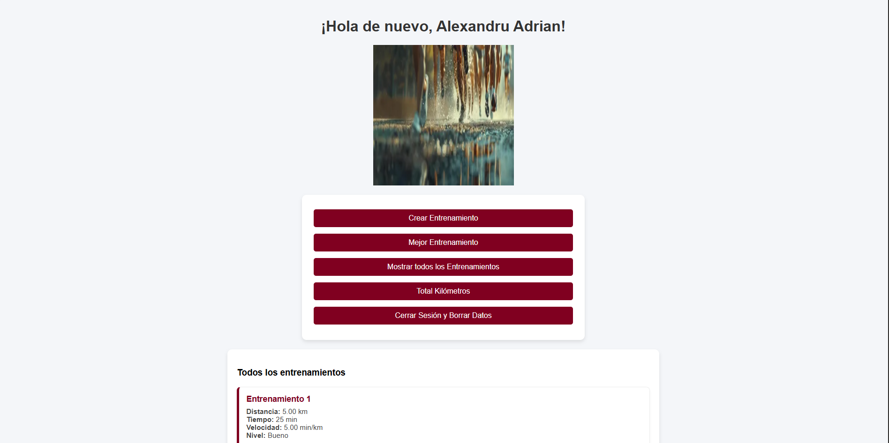

# 🏗️ Arquitectura del sistema

## 🖼️ Diagrama

---

## 🧠 Explicación técnica

RunTrack es una **aplicación web estática**:

- **HTML** → estructura de la interfaz  
- **CSS** → diseño visual  
- **JavaScript** → lógica de la aplicación  
- **localStorage** → almacenamiento de datos en el navegador  

No utiliza backend ni base de datos externa.

---

## 🛠️ Tecnologías

- HTML5  
- CSS3  
- JavaScript (ES6)  
- localStorage  
