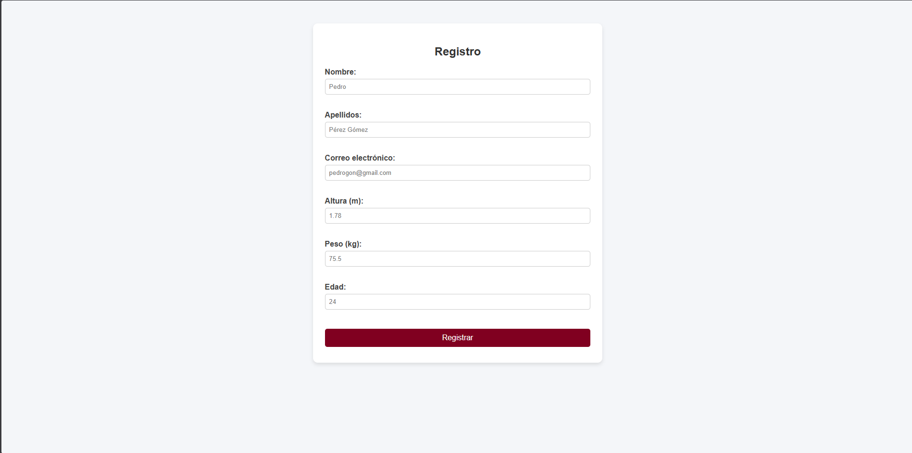

# Uso

## Capturas

## Casos de uso

- Registrar un entrenamiento indicando distancia, tiempo y ritmo.
- Consultar el historial de entrenamientos.
- Ver estadísticas básicas (distancia total, ritmo medio).
- Eliminar o editar entrenamientos guardados.

## Usuarios tipo

- Corredores principiantes.
- Corredores intermedios que quieren controlar su progreso.
- Usuarios que prefieren una app ligera sin instalación.
